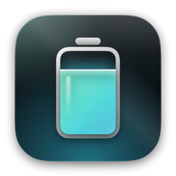
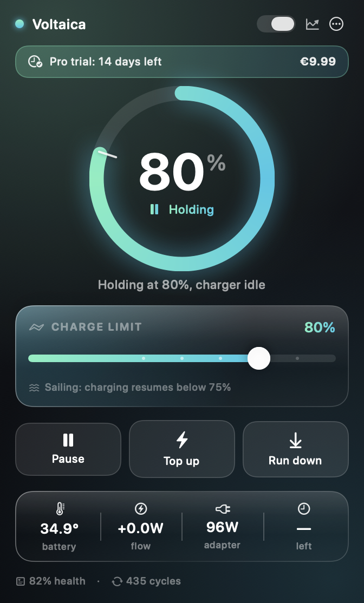

<div align="center">



# Voltaica

**Charge limiting and battery care for Mac laptops.**
A charge limit your Mac actually holds, sailing instead of trickle charging, heat protection,
and every number the battery will tell you — in a menu bar app that looks like it belongs on macOS.

[](https://github.com/fedeinfe/voltaica/actions/workflows/ci.yml)
&nbsp;·&nbsp; macOS 14+ &nbsp;·&nbsp; Apple silicon and Intel &nbsp;·&nbsp; €9.99 once, no subscription



</div>

---

## Why

A lithium pack ages fastest when it sits full and warm. A MacBook on a desk sits at 100% all day,
warm, and the charger keeps topping it up every time it drifts a fraction of a percent. Apple's own
Optimised Charging helps a little, but it decides for you, it only shows up as "about 80%", and it
gives you nothing to look at.

Voltaica stops charging at a limit you pick, leaves the charger off while the charge drifts down,
pauses while the pack is hot, and shows you exactly what the battery is doing.

## What it does

| | |
|---|---|
| **Charge limit** | Hold anywhere from 20% to 100%. Enforced by a root service, so it survives logout, sleep and a crash of the UI. |
| **Sailing** | Once the limit is reached the charger stays off until the charge has drifted a set amount below it. Far fewer charger cycles than a hard limit. |
| **Heat protection** | Stop charging above a temperature you choose, with a floor so a nearly empty battery always charges. |
| **Top up once** | Charge to 100% now, for a flight or a long day out, then go back to the limit by itself. |
| **Scheduled top up** | Be full by 08:00 on the days you actually travel. |
| **Run down** | Cut adapter power and walk a full battery back down to the limit instead of waiting for it to drain. |
| **Guided calibration** | Full charge, soak, controlled discharge, recharge — so the percentage macOS reports means something again. |
| **Sleep aware** | The adapter is handed back before the Mac sleeps, so a sleeping Mac never drains on the desk. |
| **Health and history** | Cycle count, design vs nominal capacity, cell voltages, lifetime temperature, and a chart of charge, temperature and power over time. |
| **Diagnostics** | The raw SMC keys and IORegistry values behind every number, so nothing is a black box. |
| **MagSafe LED** | Optional: the light matches what the policy is doing rather than what the charger thinks. |
| **CLI** | `voltaicactl` for scripts, plus `voltaicactl selftest` to prove the write path works on your Mac. |

The status item is drawn, not a glyph: the charge fills the battery, your limit is marked inside it,
and the colour follows the policy state.

## Install

Download the notarised `Voltaica.dmg` from [Releases](https://github.com/fedeinfe/voltaica/releases),
drag it to Applications, and open it. On first run Voltaica asks to install its background service;
approve it in **System Settings › General › Login Items & Extensions › Allow in the Background**.

Then, to be sure the charger really obeys:

```bash
/Applications/Voltaica.app/Contents/MacOS/voltaicactl selftest
```

### Why a background service at all

Holding a charge limit means writing SMC keys, and the SMC will only take those writes from root.
The app itself is a normal unprivileged app; a small `launchd` daemon does the writing and nothing
else. It is installed with `SMAppService`, which is why macOS asks you to approve it, and it can be
removed from Voltaica's settings at any time.

The daemon hands the charger back to macOS whenever the policy is off, when it shuts down, and when
it is uninstalled. A Mac that will not charge because a battery tool stopped running is a broken
Mac, and Voltaica is built so that cannot happen. If it ever does:

```bash
sudo /Applications/Voltaica.app/Contents/MacOS/voltaicactl reset
```

That writes the charger keys back to their default and needs nothing else running.

## Price

€9.99, once. No subscription, three Macs per license, updates included.

Everything that reads and reports is free forever, along with the 80% ceiling. A license unlocks
custom limits, sailing, discharge, heat protection, schedules and calibration. Every feature is
unlocked for 14 days when you first install, without asking for anything.

## Build it yourself

```bash
git clone https://github.com/fedeinfe/voltaica
cd voltaica
./Scripts/build.sh
open build/Voltaica.app
```

Swift 5.9 and Xcode command line tools are all you need; there is no `.xcodeproj`, the bundle is
assembled by the script. Without an Apple Developer certificate the build is ad-hoc signed, which
is fine for your own machine but means macOS will not let the daemon register — see
[docs/BUILDING.md](docs/BUILDING.md).

## Licensing

Voltaica is dual licensed on purpose.

* The engine, the background service and the CLI (`Sources/VoltaicaCore`, `Sources/VoltaicaHelper`,
  `Sources/voltaicactl`) are **GPL-3.0-or-later**. That is the code that talks to your hardware, so
  it is free software: audit it, reuse it, fork it.
* The app (`Sources/Voltaica`) and the artwork are **source available** under
  [LICENSE-APP](LICENSE-APP): read it, build it, run your own build, but do not redistribute or sell
  it. A paid license covers the signed and notarised build.

## Not AlDente

AlDente by AppHouseKitchen is the app that made charge limiting on macOS normal, and it is worth
paying for. Voltaica is an independent implementation that shares no code with it: it is written
from public documentation of the SMC and of `AppleSmartBattery`, and it uses no AlDente asset, name
or text. Nothing here is affiliated with AppHouseKitchen or with Apple.

## Documentation

* [docs/ARCHITECTURE.md](docs/ARCHITECTURE.md) — how the app, the daemon and the SMC layer fit together
* [docs/SMC.md](docs/SMC.md) — the keys Voltaica writes, and why only those
* [docs/BUILDING.md](docs/BUILDING.md) — signing, notarising, release
* [docs/FAQ.md](docs/FAQ.md) — is this safe, will it void the warranty, what about Optimised Charging
* [SECURITY.md](SECURITY.md) — reporting a vulnerability in a root daemon
* [CHANGELOG.md](CHANGELOG.md)
